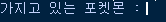
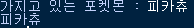

# 변수를 이용하여 데이터를 저장하자

  ## 변수의 개념
  
  #### 변수란? 
 변수([variables.py](../3.string+function+library+crawling/variables.py))란 변하는 수. 데이터(값)을 저장하는 공간을 뜻합니다. 변수에 데이터를 저장한 뒤, 언제든지 사용하거나 값을 변경할 수 있습니다.
  
  우선 현재 나이와 5년뒤의 나이를 출력하는 코드를 살펴보겠습니다.
   ```python
    print("현재 나이 : 25살")
    print("5년 뒤의 나이 : 30살")
```
    
   ```python
    age = 25  # 현재 나이
    print(f'현재 나이 : {age}살')
    print(f'5년 뒤의 나이 : {age+5}살')
```
  
  위에 두 코드는 같은내용을 출력합니다. 첫번째 코드는 `print` 함수에서 현재 나이와 5년 뒤의 나이를 각각 입력하였고, 두번째 코드는 `age` 라는 변수에 현재 나이를 저장하고, `age` 변수를 이용하여 현재 나이와 5년 뒤의 나이를 출력하였습니다.
  
  이때, 현재 나이를 22살로 수정하고자 하면, 수정한 코드는 다음과 같습니다.
  
   ```python
    print("현재 나이 : 22살")
    print("5년 뒤의 나이 : 27살")
```
    
   ```python
    age = 22  # 현재 나이
    print(f'현재 나이 : {age}살')
    print(f'5년 뒤의 나이 : {age+5}살')
   ```
  
  첫번째 코드는 `print` 함수 내의 나이를 각각 22살과 27살로 수정해야 하지만, 두번째 코드는 간단히 `age` 변수에 저장된 값만 22로 수정해주면 됩니다. <br> 이렇게 변수를 이용하면 좀 더 편하게 데이터를 관리하고 사용할 수 있습니다.
  
   ### 변수 선언 방법, 사용 방법
  
   앞에서 간단히 변수에 대해 알아보았습니다. 이제 변수를 생성하는 방법에 대해 알아봅시다.<br> 우선 C언어에서의 변수 선언 방법은 다음과 같습니다.
   ```c
    int a = 10;
```
   
   c언어 뿐만 아니라 대부분의 프로그래밍 언어들은 위의 방식으로 변수를 선언합니다.
   <br>`int`는 자료형을 뜻하고, `a`는 변수 이름, `10`은 변수에 대입할 값입니다.
   <br>`자료형` `변수명` = `대입할 값`
   <br>이 세가지 요소를 이용하여 변수를 선언합니다.
   <br><br>이때, `자료형`과 `변수명`을 이용하여 변수를 생성할때, 변수를 **선언**했다고 하고, `대입할 값`을 이용하여 변수의 초기값을 정해주면, 변수를 **초기화** 했다고 말합니다.
   위의 코드는 `a`라는 변수를 선언과 동시에 초기화 한것이고, 선언과 초기화를 따로 하면 다음과 같습니다.
   ```c
   int a; //변수 선언
   a = 10; //변수 초기화
   ```
   
   하지만 **파이썬**에서는 조금 다릅니다. 파이썬에서 변수를 생성하는 방법은 다음과 같습니다.
   ```python
   a = 10
   ```

   c언어의 변수선언 방법과 차이점이 보이시나요? `자료형`을 쓰지 않았습니다. 파이썬에서는 `대입할 값`을 보고 자동으로 자료형을 판단하기 때문에, `자료형`을 쓰지 않아도 됩니다. 
   
  ###변수 이름 짓기
  
  내가 원하는 대로 변수 이름을 지을 수 있지만, 파이썬에서는 변수명을 정할때 지켜야 할 몇가지 **규칙**들이 있습니다.
  
  * 숫자, 영문자(대, 소문자 구분), 언더바(_)를 사용할 수 있다.
  * 첫 자리에는 숫자를 사용할 수 없다.
  * 연산자로 사용하고 있는 기호(+,-,* 등)나 공백등 등은 사용할 수 없다.(공백 대신 언더바(_) 사용)
  * 파이썬 키워드는 변수 명으로 사용할 수 없다. ex) True, False, None, if, for, ...  
  
 
# 파이썬 문자열 입출력, 라이브러리 및 함수(개념 + 실습)
  ### 파이썬 문자열 입출력([input+print.py](../3.string+function+library+crawling/input+print.py))
  
 이번에는 문자열 입출력에 관해서 한번 알아보겠습니다.
 우선, 파이썬에서 어떤 내용을 결과창에 출력하기 위해서는 `print`함수를 이용합니다. `print`함수는 `print(출력할 내용)` 형식으로 사용할 수 있습니다.<br>
 ```python
a = 2+3
print(a)
```
```python
print(2+3)
```
위의 두 코드를 실행해보면 결과창에는 `2+3`의 결과인 `5`가 출력되는것을 알 수 있습니다.<br>그럼 문자열을 출력하기 위해서는 어떻게 해야할까요?
```python
print(Haedal)
```
이렇게 하면 `Haedal`이라는 문자열이 출력되지 않고, 다음과 같은 오류가 뜹니다.<br>
`NameError: name 'Haedal' is not defined`

직역하자면 'Haedal' 이라는 이름이 정의되지 않았다고 합니다. `Haedal`을 변수로 인식하고 있기 때문에 오류가 뜹니다.
<br>`Haedal` 이라는 변수가 아닌, 문자를 그대로 출력하고 싶다면 문자열을 작은 따옴표 `' '`, 또는 큰 따옴표 `" "`로 감싸주면 됩니다.

`print('Haedal')`

이렇게 코드를 작성한 후 실행하면 정상적으로 `Haedal`이 출력되는 것을 알 수 있습니다.

  
  
  <br>
  이번에는 문자열을 입력하는 방법을 배워보겠습니다.
  
  사용자에게 문자열을 입력받을 때에는 `input` 함수를 이용합니다. `input`함수는 `input("프롬프트")` 형식으로 사용할 수 있습니다.<br>
  `프롬프트`란, 사용자의 명령을 받아들일 준비가 되었음을 모니터에 나타내는 표시를 뜻합니다.
  
  
  ```python
my_pokemon = input("가지고 있는 포켓몬 : ") 
print(my_pokemon)
```





출력 결과를 살펴보면, `input` 함수 내에 `프롬프트`로 입력한 내용이 출력되면서 깜빡입니다.<br>
이때, 사용자가 문자열을 입력하면, `my_pokemon`이라는 변수에 저장이 되고, `print` 함수를 이용하여 변수 `my_pokemon`을 출력합니다. 
  
  
  
  ### 함수란?, 함수 사용하자([functions.py](../3.string+function+library+crawling/functions.py))
  
  **함수(function)** : 파이썬에서 함수란, 어떤 작업을 수행하는 코드를 모아 이름을 붙인 것입니다. 
  
  함수는 크게 두종류로 나눌 수 있습니다.
  - 내장 함수 : 파이썬에 포함된 함수 ex) `print`, `input`
  - 사용자 정의 함수 : 직접 만들어 사용하는 함수
  
  파이썬 **내장 함수**는 아무런 설정 없이 바로 사용할 수 있습니다. 지금까지 배웠던 `print`, `input`등이 파이썬 내장 함수 입니다.
  <br>하지만, 내가 원하는 함수가 없을때는 직접 만들어서 사용할 수 있습니다. 이를 **사용자 정의 함수** 라고 합니다.
  
  함수의 선언방법은 다음과 같습니다. 
  ```python
def 함수이름(매개변수) :
    실행할_명령
    return 반환값
```
**매개변수**란, 이 함수에 입력으로 전달되는 값을 받는 변수이고, **반환값**은 함수의 결과로 돌려주는 값입니다.
<br>이때, **매개변수**와 **반환값**은 필요하지 않은 경우 생략해도 됩니다.

```python
# functions.py

def gotcha():
  print("잡았다!")

gotcha() #함수 호출

# 매개변수 사용하는 함수
def add(num1, num2):
  return num1 + num2
print(add(1,1)) 

def add_mul(num1, num2):
  return num1 + num2, num1 * num2
print(add_mul(1,2))

# 100만번 이상 진행하면, 생각보다 편하다
def attack(name):
  print(name, "100만 볼트")
  print(name, "전광석화")
  print(name, "번개")

attack("피카츄")
attack("라이츄")
attack("피츄")
```
  
  위의 예제 코드에서`gotcha`, `add`, `add_mul`, `attack` 이라는 4개의 함수를 정의했습니다.
  하나씩 한번 살펴보겠습니다.
  ```python
def gotcha():
    print("잡았다!")
gotcha()
```
"잡았다!"라는 문자열을 출력하는 `gotcha`함수를 선언하였습니다. 하지만 선언만 하고 사용하지 않으면 함수가 실행되지 않습니다.
<br>`gotcha()` 코드를 추가함으로써 `gotcha`함수를 실행하였습니다. 이렇게 정의해놓은 함수를 불러오는 것을 함수를 **호출**한다고 합니다.


```python
# 매개변수 사용하는 함수
def add(num1, num2):
  return num1 + num2
print(add(1,1)) 
``` 
`num1`, `num2`의 두개의 매개변수를 사용하여, 두개의 합을 반환값으로 가지는 `add`함수를 정의하였습니다.
<br>두개의 매개변수가 존재하기 때문에, 호출할 때에도 두개의 값을 전달해줘야 합니다.
<br> `print(add(1,1))` 를 입력하여 두개의 값을 전달하여 호출할 수 있습니다. 이때, 함수를 호출할때 전달되는 값을 **인자**라고 합니다.
<br> **매개변수**랑 **인자**의 개념을 혼동하기 쉬운데,
**매개변수**는 함수 내애서 사용하는 **변수**이고, **인자**는 함수를 호출할때 전달되는 **값**입니다.
<br>위의 코드에서는 `num1`, `num2`가 매개변수가 되고, `add(1,1)` 에서 정수 `1`과 `1`이 인자가 됩니다. 

```python
def add_mul(num1, num2):
  return num1 + num2, num1 * num2
print(add_mul(1,2))
```
`add_mul`함수도 `add`함수와 마찬가지로, 두개의 매개변수를 가지는 함수입니다.
이때, 반환값을 보면 `num1 + num2` , `num1 * num2`입니다.
<br>이와 같이, 반환값이 여러개 필요한 경우 `,`로 구분하여 여러개를 반환값으로 가질 수 있습니다.   
  
```python
def attack(name):
  print(name, "100만 볼트")
  print(name, "전광석화")
  print(name, "번개")

attack("피카츄")
attack("라이츄")
attack("피츄")
```  
  
  
  
  ### 모듈 `random` 이용한 로또 뽑기([lotto.py](../3.string+function+library+crawling/lotto.py))
  
  **모듈(module)** :  함수나 변수 또는 클래스를 모아 놓은 파일입니다. 모듈은 다른 파이썬 프로그램에서 불러와 사용할 수 있게끔 만든 파이썬 파일이라고도 할 수 있습니다.
  
  내가 원하는 기능을 하는 함수가 있는데, 이미 누가 만들어 놨을 가능성이 큽니다. 다른사람이 만든 모듈을 이용하면 함수들을 가져와서 사용할 수 있습니다.
  모듈에서도 파이썬 내장 모듈이 존재하는데, `math`, `random`, `time` 등의 모듈이 있습니다.
  자세한 모듈 내용은 [파이썬 문서](https://docs.python.org/3.7/py-modindex.html)에서 확인할 수 있습니다. 
  
  모듈 이름을 알고있다면 `import` 를 이용하여 모듈을 사용할 수 있습니다.
  ```python
import 모듈이름
```  

`random` 모듈을 이용하는 코드를 살펴보겠습니다.
  ```python
# 로또 번호 뽑아보자
import random

numbers = range(1, 46) # 1~45의 정수

lotto = random.sample(numbers, 6)
print(lotto)
print(f'오늘의 행운의 로또는 {sorted(lotto)} 입나다')
```

`random.sample(a, n)` : a에서 랜덤한 n개의 데이터를 추출하는 함수

`import random` 으로 `random`모듈을 가져오고 `random` 모듈 내의 `sample`함수를 이용하여 1부터 45까지의 정수 중에서 6개를 뽑아서 출력하였습니다.   

  ### 객체지향 개념 + 실습(아직 코드 못짬, 포켓몬 활용해 예제 만들어보자)

# 변수

* [Distance, Rate, Time](https://docs.google.com/document/d/1PMicD9_aFHcaC6UdwsKTJ-9Grs3jtMSOkul8ET681vE/edit)
* [Evaluating Expressions](https://docs.google.com/document/d/1jS-6TvA3_CdSGEtyKTPlRIP6-uZ4RvEYOg3dTOozOns/edit)
* [FOIL](https://docs.google.com/document/d/1SR6Xketq5zssv4UJKGnpjGNLIMHyh0Mrz9LczkEigq4/edit)
* [Randomness in Stochastic Models](https://docs.google.com/document/d/1xYXcwsTvMUPCYypclKVXzYuOI6aX8upiLAqq9rMSfVA/edit)
* [Linear Association](https://docs.google.com/document/d/1XYw7I7FyiNmJpMDWpwOjSb5nkz9bB0-6fwa6h0xv6FY/edit)
* [Substitution with Two Equations](https://docs.google.com/document/d/1JT8cUPcnOs1T4vkzrgZVbaTGEloAL8dT9g4xaNsKDl0/edit)
# 함수
* [Factorials with Names](https://docs.google.com/document/d/1_NPCFAfbpTx-1Mkonj-Fi3thAXv5OB5FveOu177nYqU/edit)
* [Functions and Algorithms](https://docs.google.com/document/d/1akBu6hPVwCsG4Rxn9s8Jb-K0Lay
