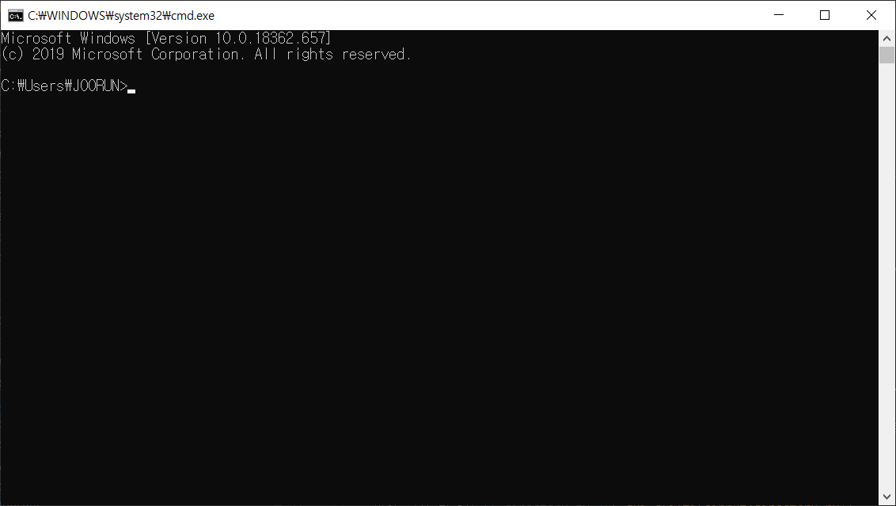
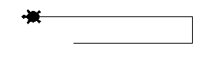
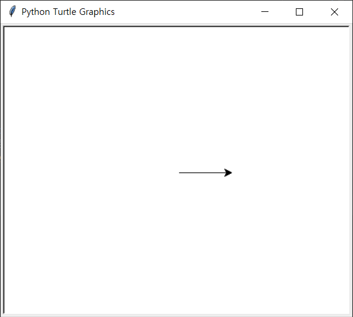
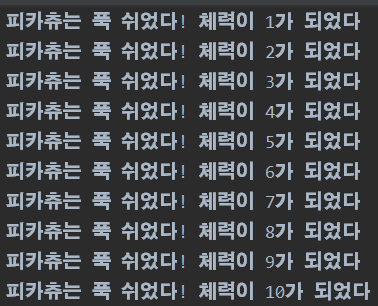
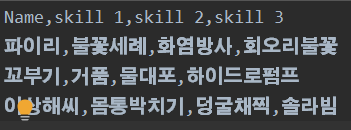

# 내 눈에 보이는 화면 + 마우스 없이 파일 다루자 
+ GUI와 CLI의 비교 및 파일 열고닫기(개념) + `turtle`, `pygame`, `tkinter`(개념) + [`pysnake`](5.gui,cli+fileinput/pysnake.py) (실습)

  ## GUI vs CLI

  __G__ raphic __U__ ser __I__ nterface  
  그리고  
  __C__ ommand __L__ ine __I__ nterface  
  우선 CLI에 대한 설명부터 먼저 하지 않을 수 없는데, 이는 우리가 정~~~말 가끔 썼던 cmd창  
    
  이것이 가장 대표적인 CLI라 할 수 있겠다. 또한 아마 수업 진행을 pycharm으로 할 텐데, 거기의 Terminal도 CLI라고 할 수 있다. 여태 수업을 진행해오면서 느꼈겠지만, Command를 Line으로 받는 Interface이기 때문에 CLI라고 하는 것이다.  
  그렇다면 '지-유-아이' 라고 읽기도 하고 '구이'라고 읽기도 하는 GUI는 무엇이냐? 대표적인 예로는 윈도우 운영체제를 들 수가 있겠다. Graphic을 활용한 User Interface이기 때문에 GUI라고 하나보다.  
  정리 : GUI = CLI + 그래픽
  
  ## UX vs UI
  __U__ ser e __X__ perience  
  그리고  
  __U__ ser __I__ nterface  
    
  UI는 사람(사용자)이 앱을 사용할 때 마주하는 기술적인 부분들이고, UX는 이 앱을 사용하는 과정에서 느끼는 경험, 감정, 느낌, 태도 등이다. 위의 그림을 예시로 들자면, USER가 자전거를 탈 때 사용하는 페달, 안장, 손잡이 등은 UI, 자전거를 탈 때 '아 기분조아!'라고 하는 것은  UX에 해당이 될 것이다.  
  예시를 하나 더 들어보자면.. 예를 들어 '수달'이라는 앱을 만들어 배포한다고 치면, 이것을 Google Play에 올릴 것인가? 혹은 직접 .apk 파일을 배포할 것인가? 부터 시작해서 앱의 디자인, 터치감, 기능성 등을 User가 사용하면서 느낄 것들을 고려하는 것이 UX 디자인이라고 할 수 있겠다.  
  ~~사실 적당히 말로 때우면 된다~~
  
  ## turtle이란?
  참고문헌 - [24. Program Frameworks - Python 3.3.7 documentation](https://docs.python.org/3.3/library/frameworks.html)  
    
  ~~귀여운 거북이~~  
  거북이..를 이용해서 아이들, 혹은 초심자에게 프로그래밍과 친해질 수 있도록 하는 모듈이다. 모듈이라는 어려운 말이 나왔다고 당황할 것 없이 그냥 기능이라고 치환해서 이해해도 괜찮을 것이다.  
  기본적인 문법 구문은 다음과 같다.  
  ```
  import turtle as t
  
  t.forward(70)
  ```  
    
  위의 코드를 실행한 모습이다. 70픽셀만큼 앞으로 가라고 명령했는데, 각도 전환, 펜 색깔, 배경 색깔, 회전, 원 그리기 등 많은 명령어(메소드)들이 있기 떄문에 구글링이나 참고문헌을 참조하면 좋을 듯 하다.  
  
  
  ## PYGAME이란?  
  참고문헌 - [About - wiki](https://www.pygame.org/wiki/about)  
  __PY__ thon  
  그리고  
  __GAME__  
  이름에서 알 수 있듯이 파이썬의 모듈을 활용하여 간단한 게임을 만들 수 있다. [예제](https://lidron.tistory.com/41)

  ## tkinter란?
  아주 어렵게 생긴 영어단어지만, '티킨터'라고 읽는다.  
  참고문헌 - [tkinter - Python interface to Tcl/Tk - Python 3.8.1 documentation](https://docs.python.org/ko/3/library/tkinter.html)
  - [playsnake](https://python.bakyeono.net/chapter-12-1.html)를 통한 게임 만들기
    [파이썬으로 뱀 게임 만들기](https://python.bakyeono.net/chapter-12-1.html) 참조해 코드 완성하자

## 파일 객체 생성
```
 파일 객체 = open( "파일 이름" , '파일 열기 모드' )
```
+ 파일 열기 모드

모드 | 이름 | 설명
 --- | --- | ---
`r`| 읽기 모드 | 파일을 읽을 때 사용  
`w`| 쓰기 모드 | 파일에 내용을 쓸 때 사용
`a`| 추가 모드 | 파일 끝에 내용을 추가 할 때 사용

원래 있던 파일을 쓰기 모드로 열 경우, 안에 있던 내용이 모두 사라지며 존재 하지 않는 파일을 쓰기 모드로 열 경우 새로운 파일이 생성됩니다.

다음 코드를 입력하고 실행해보세요.
```python
f = open( "new.txt" , 'w')
f.close()
```
작성중인 파이썬 파일이 포함된 `디렉토리` 안에 `쓰기 모드`로 `new.txt` 파일이 생성되었음을 알 수 있습니다.

  

```
파일 객체 = open( "파일경로/파일이름.txt", '읽기 모드' )
```
이렇게 작성하면 다른 디렉토리에 파일을 생성하거나 호출하여 수정할 수 있습니다.

`f.close()`는 쓰기 모드로 열려있던 파일을 다시 닫아주는 역할을 합니다. 파이썬 종료시 자동으로 파일이 닫히기때문에 반드시 포함되어야 하는 것은 아니지만 열려있던 파일을 다시 열면 오류가 발생할 수 있으므로 함께 작성해주는 것이 좋습니다.

+ 예제

앞에서 배운 `for 문`활용하여 파일에 문장을 입력해보겠습니다.
```python
f = open("new.txt", 'w')
for i in range(10):
    data = "피카츄는 푹 쉬었다! 체력이 %d가 되었다" % i
    f.write(data)
    f.write("\n")
f.close()
```
`new.txt` 파일을 확인해보면 `data`문장이 10개 출력된 것을 확인 하실 수 있습니다.

  

파일 입출력을 사용할 때마다 `f.close()`를 이용하여 파일을 열고닫아야 한다면 상당히 번거로울 것 입니다. 이는 with 문을 사용하면 해결할 수 있습니다.

위의 코드를 `with문`을 사용하여 다시 작성해보겠습니다.
```python
with open("new.txt", 'w') as f:
    for i in range(10):
        i+=1
        data = "피카츄는 푹 쉬었다! 체력이 %d가 되었다." % i
        f.write(data)
        f.write("\n")
```
`with문`을 이용하면 들여쓰기로 묶여 있는 블록밖으로 빠져나올 때 객체 `f`가 자동으로 `close`됩니다.

지금 메모장에 10개의 data문장들이 입력되어있는 상태입니다. 이번에는 `new.txt`에 입력된 문장을 읽어옵시다.
```python
print("# read 이용")
with open("new.txt", 'r') as f:
    data = f.read()
    print(data)

print("# readline 이용")
with open("new.txt", 'r') as f:
    while True:
        line = f.readline()
        if not line: break
        print(line)

print("# readlines 이용")
with open("new.txt", 'r') as f:
    lines = f.readlines()
    for line in lines:
        print(line)
```
`read` 함수를 이용 하면 메모장 전체 내용을 한번에 읽을 수 있습니다.
`readline` 함수는 한 줄씩 메모장의 내용을 읽어올 수 있습니다.
`readlines` 함수는 메모장의 전체 내용을 리스트의 형태로 저장합니다.

이번에는 `a`모드를 활용하여 메모장에 내용을 추가해보겠습니다.
```python
with open("new.txt", 'a') as f:
    f.write("피카츄의 체력이 완전히 회복되었다!")
```
`new.txt` 파일의 제일 아랫줄에 문장이 추가 된 것을 확인 할 수 있습니다.


## CSV 모듈

시작하기에 앞서 csv파일이 무엇인지 알아봅시다. `csv`는 `comma-separated-value`의 줄임말로 말 그대로 `data 값`이 `콤마`로 구분 된 파일을 말 합니다.

`csv 모듈`을 사용하기 위해서는 python 파일 가장 윗 줄에 `import`해주어야 합니다.

아래의 코드를 작성해보세요. 
```python
import csv

with open("pokemon.csv", 'w') as c:
    wr = csv.writer(c) # 
    wr.writerow(['Name', 'skill 1', 'skill 2', 'skill 3'])
```
생성된 `pokemon.csv`파일을 열어 확인 해보세요. 리스트의 각요소가 `comma`로 구분되어 출력된 것을 알 수 있습니다.

이번에는 `name`과 `skill 1,2,3`을 사용자에게 입력받아 `pokemon.csv`파일에 출력해보겠습니다.

- 세 개의 포켓몬을 입력받으며 각 포켓몬의 이름과 스킬 3개를 따로 입력받아 파일에 입력합니다.
```python
import csv

...

for j in range(3): # 3개의 포켓몬을 입력받으므로 3번 반복
    name = input("Name: ")
    skills = ['', '', ''] # 스킬들을 입력받을 list 생성
    for i in range(3): # 스킬 3개 입력받음
        print(f"skill {i+1}: ", end='')
        skills[i] = input("")

    with open("pokemon.csv", 'a') as c: # 사용자로 부터 입력받은 값들을 csv 파일에 입력 
        wr = csv.writer(c)
        wr.writerow([name, skills[0], skills[1], skills[2]])
```

`pokemon.csv`파일을 확인하면 사용자가 입력한 값이 추가되어 있는 것을 확인 할 수 있습니다.
그런데  data가 한 행씩 건너뛰고 저장되어 있습니다. 이는 파일의 입출력 모드 뒤에 `newline=''` 을 추가하면 해결 할 수 있습니다.

다음으로 코드를 수정해보세요.
```python
with open("pokemon.csv", 'w', newline='') as c:
with open("pokemon.csv", 'a', newline='') as c:
```

   

이번에는 `pokemon.csv` 파일을 읽어 봅시다.

```python
import csv

with open("pokemon.csv", 'r') as c:
    rd = csv.reader(c)
    for line in rd:
        print(line)
```
csv 파일의 각 행이 출력된 것을 확인할 수 있습니다. 
