# 안전하게 데이터를 저장하자 + 웹에서 데이터를 긁어오자
이번 차시에서는 __정보__ 와 __데이터베이스__ 의 개념을 간단히 잡고 웹에서 자료를 수집하는 __크롤링__ 실습을 진행합니다.  

## 데이터베이스와 정보
### 데이터? 정보?  
정보와 데이터(자료)를 같은 것으로 생각하고 있는 사람들이 생각보다 많습니다.   
하지만 이 둘은 엄연히 다른 개념입니다.  
+ _데이터_ : 현실세계에서 벌어지는 일들을 단순한 방법으로 관찰하고 측정해서 얻은 사실이나 값
+ _정보_ : 데이터(자료)를 처리해서 얻는, 실제 문제해결이나 의사결정에 도움이 되는 유의미한 결과   
   
예를 들어봅시다.  
여러분이 마스크 제조회사 직원이고 10년동안 월간 마스크 판매량을 조사했다고 가정합시다.   
조사한 값들은 데이터(자료)입니다.  
그런데 이 값들을 처리하여 __'마스크는 여름보다 겨울에 잘 팔린다'__ 라는 유의미한 결과를 얻어내었습니다.   
이는 정보라고 할 수 있습니다.   
이 정보를 추후 계절별 마스크 생산량을 결정하거나 다른 문제를 해결할 때 근거로 사용할 수 있을 것입니다.  
  
감이 조금 오시나요?  
정리하자면 우리는 일상생활에서 데이터들을 수집하고, 이를 추출하고 분석하여   
문제해결에 도움이 되는 정보를 알아냅니다.  

### 데이터베이스(DB)와 DBMS
다음은 _데이터베이스_ 에 대해 알아봅시다. 흔히 줄여서 DB(DataBase)라고 많이 표현합니다.  
데이터로부터 정보를 추출하기 위해서는 어딘가에 저장이 되어있어야 하겠죠?  
데이터베이스는 __여러 사람이 공유하여 사용할 목적으로 체계화해 통합, 관리하는 데이터의 집합__ 을 의미합니다.  
한마디로 데이터를 얻기 위해 효율적으로 저장된 집합체라고 표현할 수 있습니다.  

그리고 이러한 데이터베이스를 쉽게 만들고 관리하는 여러가지 프로그램들이 모여서 하나의 시스템으로 갖춰진  
것을 DBMS, 데이터베이스관리시스템이라고 부릅니다. 흔히 말하는 Oracle, MySQL, SQLServer등이 이에 속합니다.
대부분의 DB들이 DBMS를 통해 만들어지고 운영되기 때문에 DB와 DBMS가 같은 의미로 사용되는 경우가 있지만  
이 둘도 정보와 데이터처럼 엄연히 다른 개념입니다.  
 
지금까지 데이터와 정보, DB에 대해 살펴보았습니다.  
요즘같은 정보사회에서는 데이터베이스를 활용, 다양한 데이터들을 융합하여 새로운 개념을 창출함으로써  
그 가치를 증대시키는 일의 중요성이 높아지고 있습니다. 데이터베이스 전문가까진 아니더라도  
개념 정도는 기억하고 계시면 좋을 것 같습니다. :)

## 크롤링 실습 
이제 웹에서 원하는 자료를 가져오는 크롤링 실습을 해봅시다.  

### 크롤링이란(+ 매크로)?
웹 상의 수많은 데이터를 일일이 눈으로 보면서 찾아와야한다면 굉장히 번거롭겠죠?  
프로그래밍을 통해 자동화하면 굉장히 좋을 것 같지 않나요?  
  
누군가 우리보다 먼저 비슷한 생각을 하였고 이 아이디어는 웹 크롤러의 형태로 구현되었습니다.
웹 페이지들이 포함하고 있는 다양한 데이터를 웹 크롤러를 통해 쉽게 가져올 수 있습니다 :)  

_Web Crawling_ 혹은 _Web Scraping_ 은 컴퓨터 소프트웨어 기술로 웹사이트들에서 원하는 데이터를 추출하는 것을 의미합니다.  
그리고 이 작업을 수행하는 프로그램을 _웹 크롤러(Web Crawler)_ 라고 합니다.  
비트코인의 시세를 가져온다거나, 영화 순위 사이트에서 상위 10개의 영화 제목 데이터를 가져오는 것 등을    
예시로 들 수 있습니다.  
다른 활용방안으로 머신러닝을 위한 빅데이터 수집에도 사용할 수 있습니다. 만약 여러분의 이미지 분류 모델에    
사과 이미지를 학습시키기 위한 이미지 자료를 마련하길 원한다면, 구글에서 사과를 검색하고 해당하는 이미지들을 쭉 모아오도록     
웹 크롤러를 프로그래밍하면 됩니다

### 크롬 개발자 도구를 활용한 웹 정적 리버싱  
안타까운 소식이 하나 있습니다.  
여러분이 웹 크롤러 프로그램을 작성하기 위해서는 원하는 정보가 웹 페이지의 어느 부분에 있는지 알아야 한다는 점입니다.  
물론 웹페이지의 소스 전체를 들고 오는 것은 웹페이지의 구조를 몰라도 가능하지만, 특정 데이터만을 들고 오는 크롤러를  
만들기 위해서는 여러분의 목표 사이트의 구조를 뜯어볼 필요가 있습니다.  
   
하지만 너무 걱정하지 마세요!  
크롬 브라우저가 제공하는 개발자 도구를 활용하면 위의 작업을 손쉽게 할 수 있습니다.   
그럼 지금부터 실제 크롤링을 하기 앞서 크롬 개발자도구를 이용해 일종의 리버싱 작업을 하는 방법을 살펴보겠습니다.  
(_리버싱_ : __소프트웨어 분야에서 해당 프로그램의 구조, 기능, 동작 등의 원리를 역으로 따라가며 이해하고 분석하여   
부족한 부분이 있거나 추가 되었으면 하는 새로운 기능 등을 추가하는 전체적 행위__)

** HTML과 CSS의 구조는 해당 문서에서 다루지 않습니다. 관련내용은 WWW 레포지토리의 해당 문서를 참고해주세요.  
  
1. 먼저 크롬 브라우저를 실행시키고 네이버로 들어가주세요.  
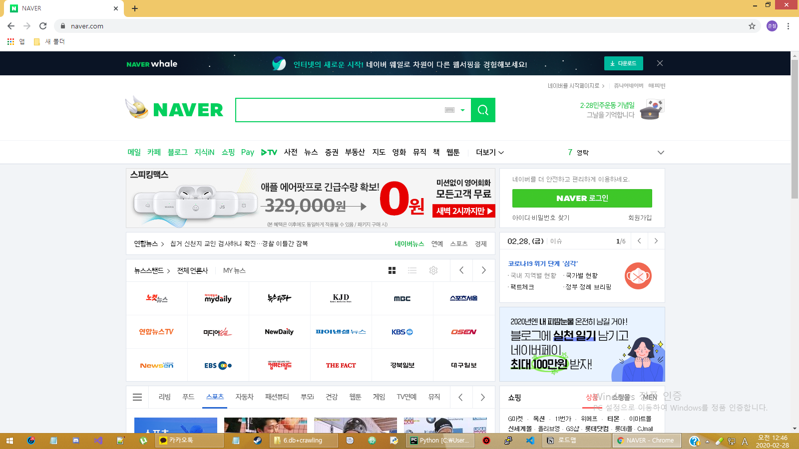  

2. 키보드의 F12를 누르면 크롬 개발자 도구가 나타나는 것을 확인할 수 있습니다.    
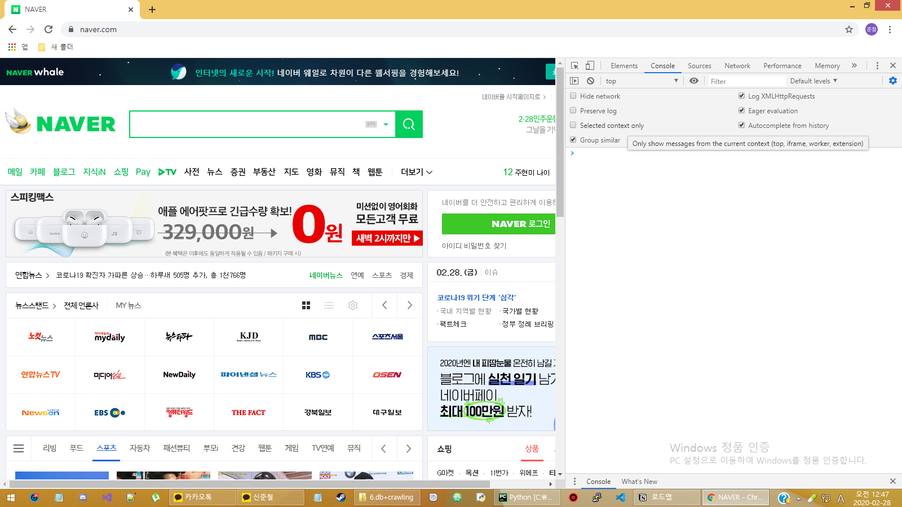  

3. Elements를 클릭하면 여러분이 보고 있는 웹페이지의 소스를 볼 수 있습니다.  
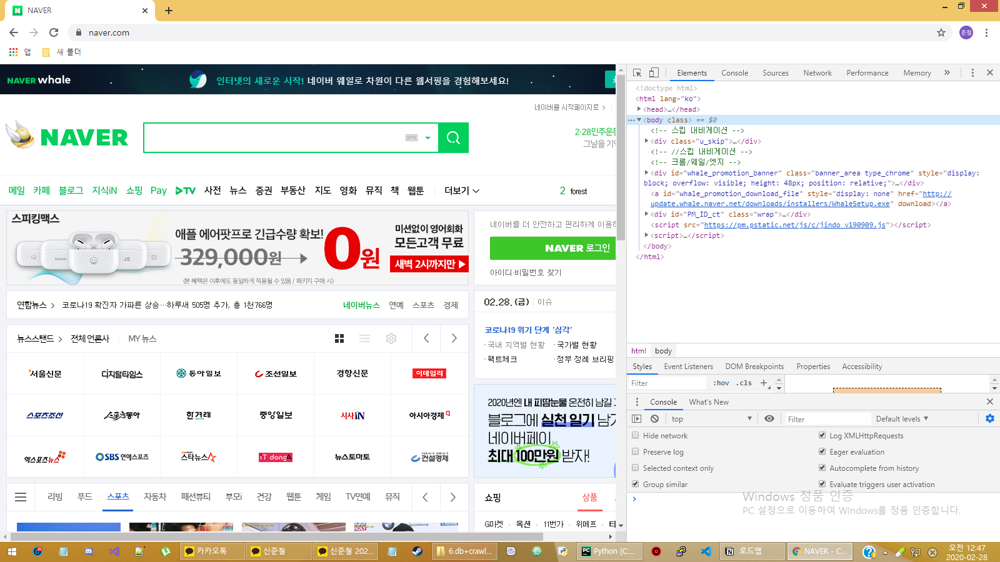  

4. 소스 코드에 마우스를 올려보시기 바랍니다. HTML 파일에서 여러분의 마우스가 가리키고 있는 지점이  
   브라우저에서 어떻게 보이는지 바로 확인할 수 있습니다.  
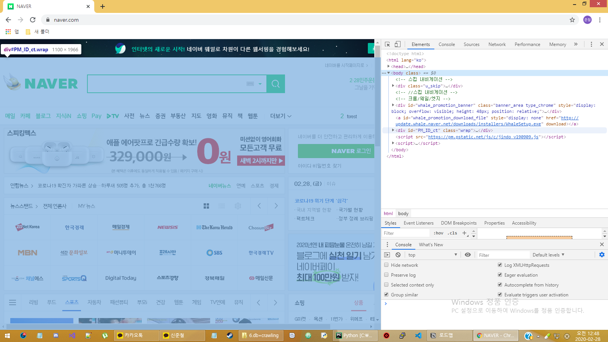  

5. 반대도 가능합니다. Elements 왼쪽에 마우스 커서 모양의 아이콘을 클릭해주세요. 그리고 브라우저에서 보여지고 있는  
   화면으로 마우스를 이동시켜보세요. 마우스가 있는 부분이 HTML 소스의 어느 부분인지 확인할 수 있습니다.  
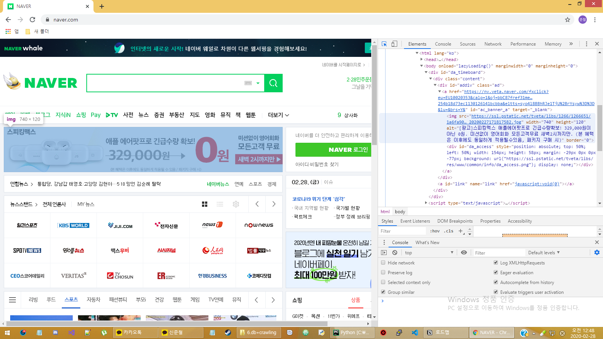  
  
자 그럼 이제 정말 실슴으로 넘어갈 차례입니다.  
먼저 멜론 실시간 차트 자료를 가져오는 실슴을 진행하고, 다음으로 네이버 실시간 검색어 순위 자료도 가져와보겠습니다.     

###. 멜론 실시간 차트 가져오기  

먼저 필요한 라이브러리들을 가져오고 headers 변수를 선언합니다.
_requests_ 는 HTTP 요청을 주고받을 수 있는 라이브러이고,  
_bs4_ 는 HTML 및 XML 파일에서 원하는 데이터를 손쉽게 Parsing 할 수 있는 Python 라이브러리 입니다.  
```python
import bs4 #pip install bs4
import requests #pip install requests

headers ={
  'User-Agent': 'Not_Crawling X)' 
}
```
HTTP header에서 'User-Agent' 값은 client의 웹브라우저에 대한 정보를 담는 공간입니다.  
추후 header 설정을 따로 해주지 않으면 파이썬에서 자동으로 'Python-urllib/x.x'을 입력하여 HTTP를 보냅니다.  
문제는 멜론에서 크롤링을 막기 위해서인지 파이썬으로 접속하는 client들에게는 HTML 문서를 보내지 않습니다.  
따라서 멜론을 속이고 크롤링을 진행하기 위해 header의 User-Agent 값을 임의로 변경해줍니다.  
(2020/2/27: 임의의 문자열을 넣어도 문제없음을 확인했습니다.)   
  
자 그리고 멜론에 접속하여 우리가 찾고자 하는 데이터가 어디 있는지 알아봅시다.  
앞서 가르쳐드린 개발자 도구를 활용하시면 됩니다 :)  
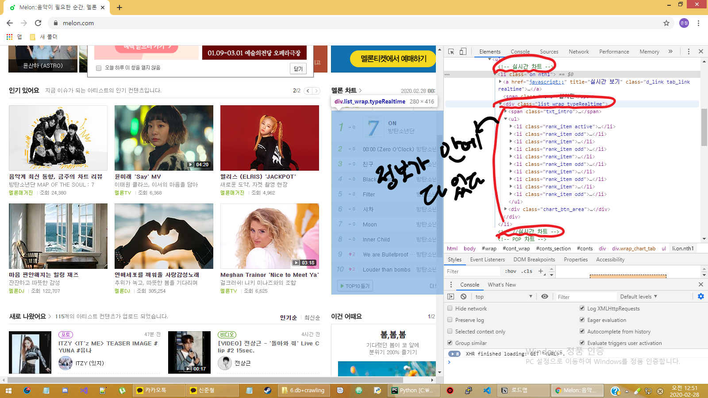  
확인해 보면 'on nth1' 클래스를 가진 태그 하위의 'list_wrap typeRealtime' 클래스 하위의 rank_item 클래스 안에  
우리가 원하는 정보가 다 들어 있음을 확인할 수 있을 것입니다.  
따라서 다음과 같이 코드를 작성합니다.  
```python
response = requests.get('https://www.melon.com',headers=headers).text
soup = bs4.BeautifulSoup(response, 'html.parser')
songs = soup.select('.on.nth1 >.list_wrap.typeRealtime>ul>.rank_item')
```
먼저 requests 라이브러리를 통해 멜론 사이트의 응답을 받아 문자열로 바꾸어 response 변수에 저장합니다.  
그리고 BeatifulSoup에 html 소스로 파싱한다고 옵션을 정하고, response를 파싱한 결과값을  soup 변수에 넣습니다.    
html을 파싱한 soup에서 아까 알아낸 구조대로 .rank_item을 select하면 해당 키워드들을 리스트 형태로 반환해 줍니다.  
             
  
이제 csv파일을 하나 생성해 우리가 캐낸 데이터를 저장해보겠습니다.
with문을 활용하여 open하므로 후에 close하지 않아도 됩니다.  
만들 파일 이름은 melon_rank.csv이고 쓰기 목적이므로 'w'로 옵션을 지정합니다.   
```python
with open('melon_rank.csv', 'w') as f:
  for song in songs:
    rank = song.select_one('div.rank_number > span.rank').text
    title = song.select_one('div.rank_cntt > div.rank_info > p.song > a').text
    artist = song.select_one('div.rank_cntt > div.rank_info > div.artist > div.ellipsis > a').text
    f.write(f'{rank}위,{title},{artist}\n')
```
자 다시 개발자 도구로 돌아갈 차례입니다.  
앞서 찾은 .rank_item 하위에 순위, 제목, 가수가 어느 부분에 있는지 알아냅시다.  
먼저 순위는 rank_number 클래스의 div 태그 하위의 rank 클래스의 span 태그에 있음을 알 수 있고,  
제목은 div.rank_cntt 하위의 div.rank_info 하위의 p.song 하위의 a 태그에 있음을 알 수 있습니다.  
마지막으로 가수는 div.rank_cntt 하위의 div.rank_info 하위의 div.artist 하위의 div.ellipsis 내부의 a 태그에 있음을    
알아냅니다.  
그리고 이번엔 select_one을 이용하여 하나의 해당 키워드를 뽑아 문자열로 바꿉니다.  
이후 f.write를 통해 csv파일에 기록합니다. ','를 이용해 value들을 구분하게 됩니다.  
  
끝났으면 엑셀로 csv파일을 열어 우리가 원하는대로 기록이 되었는지 확인합니다.    
잘 기록이 되었나요? :)  
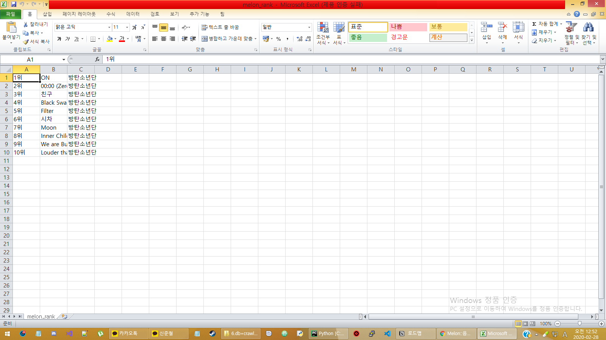
  
###. 네이버 실시간 검색어 순위 가져오기
마지막으로 네이버 실시간 검색어 순위를 가져와 txt 파일로 저장해보겠습니다.  
앞의 실습이랑 같지 않냐구요?    
네이버 실시간 검색어는 앞서 사용한 방식으로 크롤링 할 수 없습니다.  
네이버가 이제 실시간 검색어 부분을 동적으로 불러오도록 해 놓았기 때문입니다.  
직접 보는 것이 훨씬 빠르겠죠!   

네이버에 접속하고 크롬 개발자도구를 켜봅시다.  
_Ctrl + shift + p_ 를 누르고 _disable JavaScript_ 를 선택하고 F5를 눌러봅시다.  
실시간 검색어가 보이나요?      
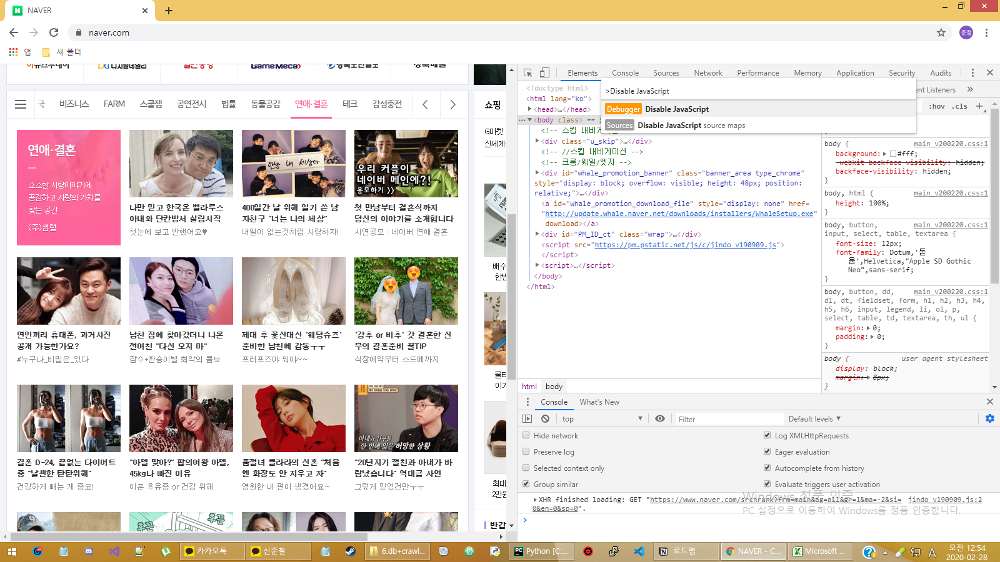

자바스크립트로 동작되는 부분은 지속적으로 데이터를 가지고 와서 업데이트됩니다.  
따라서 현재 보이는 데이터가 아닌, 그 원본 데이터의 주소를 알아야 합니다.  
아까와 마찬가지로 크롬 개발자 도구를 사용하면 확인할 수 있습니다.  
정말 편하죠? :)
크롬 개발자 도구에서 _enable JavaScript_ 한 후 _network_ 로 들어갑니다.  
이후 F5를 눌러 새로고침해봅시다.  
XHR을 선택하여 자바스크립트를 이용해 비동기적으로 데이터를 교환하는 부분(Ajax)만  
확인할 수 있습니다. 그리고 _Header_ 의 _Request URL_ 을 확인하면 해당하는 내용을  불러오는 url을 확인할 수 있습니다.  
옆의 _Preview_ 에서 그 내용을 확인할 수도 있습니다.  
 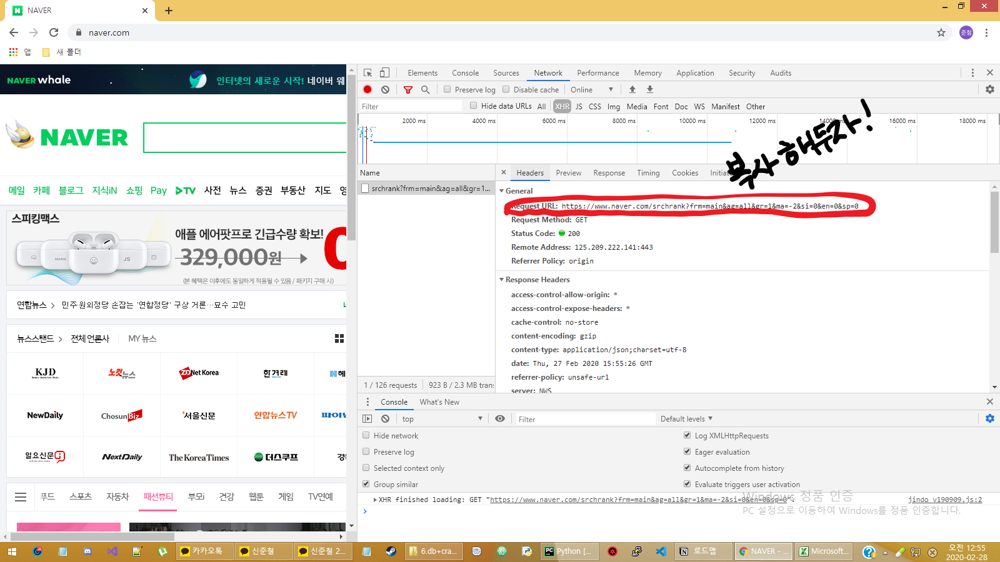   
 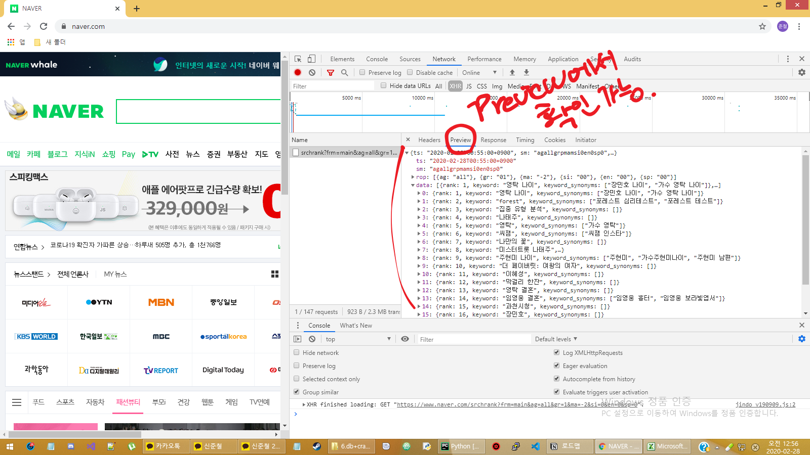
 
 자 그럼 모든 준비가 끝났습니다.  
 코드를 작성합시다.  
 ```python
import requests # pip install requests
import datetime
import json

#아까 확인한 url
data = requests.get('https://www.naver.com/srchrank?frm=main&ag=all&gr=1&ma=-2&si=0&en=0&sp=0').text
data = json.loads(data) #json에 반환된 데이터

ranks = data['data']

now = datetime.datetime.now()

with open('naver_rank.txt', 'w', encoding='utf-8') as f:
  f.write(f'{now} 기준 네이버 검색어 순위\n')
  for i, rank in enumerate(ranks): # [(0, 'a'), (1, 'b'), ...]
    f.write(f'{i+1}. {rank["keyword"]}\n')
```
확인한 url로 요청을 보내 응답을 받아 data 변수에 받아 json.loads()를 이용하여 딕셔너리 형태로 변환합니다.  
이를 ranks 변수에 담아놓습니다.  
이번엔 현재 시각도 같이 기록해봅니다. datetime.datetime.now() 로 현재 시각을 얻어 now 변수에 저장합니다.   
기록을 위해 파일을 하나 엽니다. 이름은 naver_rank.txt로 하며 이번에는 utf-8로 encoding 설정을 하여 파일이 깨지지 않게  
만들겠습니다.  
앞선 실습에선 왜 encoding을 설정하지 않았냐구요?  
csv 파일 생성시 encoding을 utf-8로 설정하면 엑셀로 열었을 때 깨지기 때문입니다. 이번엔 단순 텍스트 파일이므로
utf-8로 encoding해줍시다.  

앞의 개발자도구의 Preview에서 봤으면 아시겠지만 ranks의 'keyword' 키에 해당하는 value들이 우리가 원하는 검색어입니다.  
따라서 반복문을 돌며 해당 문자열을 파일에 기록하도록 합니다.
enumerate를 사용하면 현재 반복 횟수 또한 알 수 있습니다. (0부터 시작합니다)  
반복횟수는 i로, ranks의 각 dictionary는 rank로 받습니다.   
코드 작성이 끝났습니다!
작성한 크롤러를 Run하고 결과를 확인해봅시다 :)  
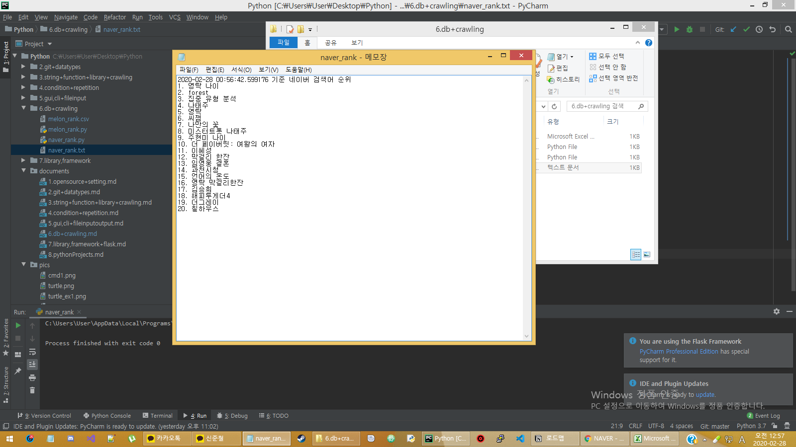


 
 
+ 데이터베이스 및 정보, 일상에서 사용할 크롤링(개념) + 내 손으로 만져 보는 크롤링(실습)
  
  - 데이터베이스 → 정보사회에서 융합을 통한 새로운 개념 창출로 가치 증대(완)
  - 귀찮은 일 자동화하기(매크로?) (완)
  - 크롤링 예시 및 활용 (완)
  - 크롬 개발자 도구를 활용한 웹 정적 리버싱(네이버 실시간 검색어) → 웹 개발 및 디버깅
  - 네이버 실시간 검색어 가져오기([`naver_rank.py`](../6.db+crawling/naver_rank.py)) 
  - melon 실시간 차트 가져오기([`melon_rank.py`](../6.db+crawling/melon_rank.py))