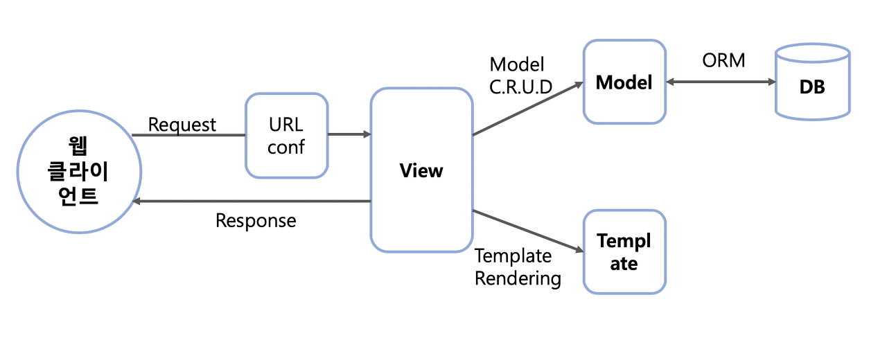
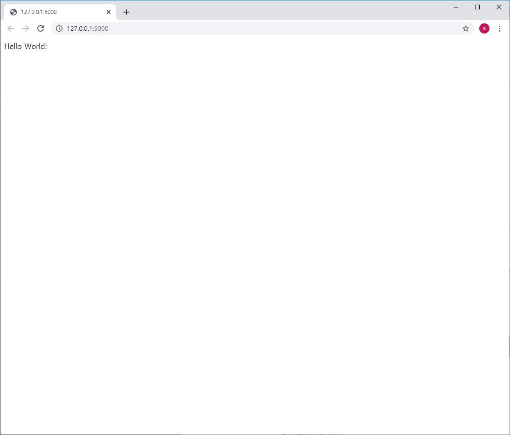
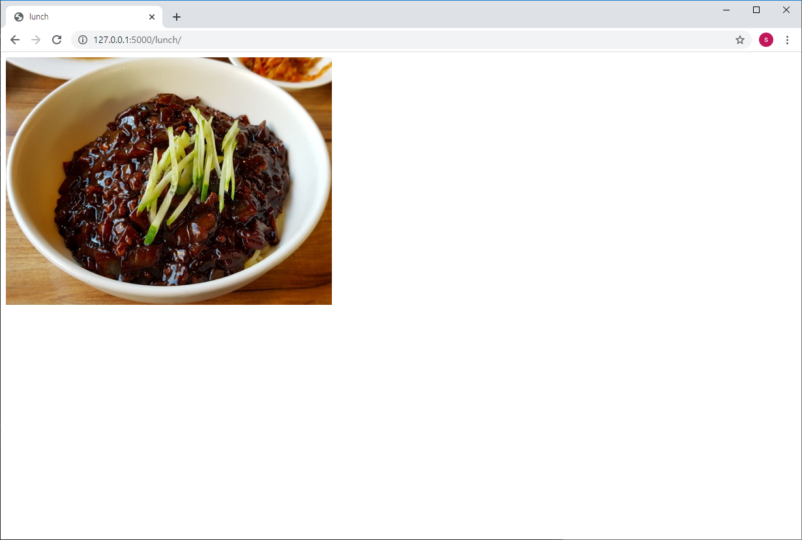

# 남이 만든 코드를 재사용하자 

# 프레임워크와 라이브러리
프로그래밍을 할 때 프레임워크와 라이브러리라는 단어를 자주 들어보셨을거라 생각합니다.  
프레임워크와 라이브러리의 개념을 알아보며, 예시를 통해 비교해보도록 하겠습니다.  
___
# Framework

```
소프트웨어의 특정 문제*를 해결하기 위해서 상호 협력하는 클래스와 인터페이스의 집합
(*객체 지향 개발을 하게 되면서 통합성, 일관성의 부족이 발생되는 문제)
```
프레임워크는 뼈대나 기반구조를 뜻하며 프로그래밍을 진행할 때 필수적인 코드, 알고리즘, 암호화, 데이터베이스 연동 등과 같은 기능들을 제공하는 인터페이스의 집합입니다. 때문에 프레임워크를 사용하는 프로그래머는 이 프레임워크의 뼈대 위에서 코드를 작성하여 프로그램을 개발하게 됩니다. 즉, 프레임워크는 완성된 제품이 아닌 완성된 제품을 만들기 위해서 개발자를 도와주는 또는 기반이 되는 역할을 합니다.  
<br></br>
* **언어별 대표 프레임워크**  

|프로그래밍 언어|프레임워크|
|:---:|:---:|
|Python|Django, Flask|
|Java|Spring, Struts|
|JavaScript|React, AngularJS|
|PHP|Laravel, Symphony, Symphony|

<br></br>
>* **Django로 알아보는 프레임워크**
><br></br>
>Django는 Python 기반의 무료 오픈소스 웹 애플리케이션 프레임워크입니다.  
>웹사이트는 기본적으로 사용자 인증(회원가입, 로그인, 로그아웃)이나 웹사이트의 관리자 패널, 폼, 파일 업로드와 같은 비슷한 요소들을 필요로 합니다.  
>장고는 이러한 요소들을 신속하게 개발하는데 도움을 주는 구성요소로 이루어져 있어, 개발자는 웹 개발에서 번거로운 요소들을 새로 개발할 필요 없이 내장된 기능만을 이용해 빠른 개발을 할 수 있습니다.
><br></br>
><p align="center"></p>
>
><br></br>
> **Django의 MVT 패턴**
>
>장고는 `Model`, `View`, `Template`의 앞 글자를 딴 MVT 아키텍쳐를 기반으로 합니다.
>`모델`은 데이터 베이스에 저장되는 데이터의 저장,수정,변경 등을 기능을, `템플릿`은 사용자에게 보여지는 UI부분을, `뷰`는 실질적으로 프로그램 로직이 동작하여 데이터를 가져오고 적절하게 처리한 결과를 템플릿에 전달하는 역할을 수행합니다.

<br></br>
___
# Library
```
프로그램 기능 수행을 위해 활용 가능한 도구들의 집합
```
라이브러리는 프로그래머가 개발하는 데 필요한 특정 기능에 대한 API(도구/함수)를 모은 집합입니다.  
개발자가 만든 클래스에서 호출하여 사용, 클래스들의 나열로 필요한 클래스를 불러서 사용하는 방식을 취하고 있습니다.  
<br></br>
* **언어별 라이브러리 예시**  

|프로그래밍 언어|라이브러리|
|:---:|:---:|
|Python|Libcloud, Arrow, Behold|  
|Java|JUnit, Jackson|
|avaScript|jQuery, Chart.js| 

<br></br>
>* **Tensorflow로 알아보는 라이브러리**
><br></br>
>구글에서 만든, 딥러닝을 구현할 수 있도록 다양한 기능을 제공해주는 오픈소스 라이브러리입니다.
>텐서플로우는 텐서(tensor; 다차원 배열로 나타내는 데이터)의 흐름(flow)을 의미합니다. 즉, 데이터 흐름 그래프(Data Flow Graph)를 사용하여 수치 연산을 해주어 기계학습 분야의 프로그램을 만들기 위한 라이브러리입니다.
><br></br>
>
>|함수|설명|
>|:---:|:---:|
>|tf.add|덧셈|
>|tf.subtract|뺼셈|
>|tf.square|제곱을 계산합니다.|
>|tf.cos|코사인 값을 계산합니다.|
>|tf.diag|대각행렬을 리턴합니다.|
>|tf.matmul|두 텐서를 행렬곱셈하여 결과 텐서를 리턴합니다.|
>
>텐서플로우가 제공하는 주요 함수들은 위와 같습니다.  
>기본적인 수학함수와 행렬 연산을 위함 함수, 그리고 수식을 계산하기 위한 세션함수 등이 있습니다.  
><br></br>
>*(인공지능에 관심있으신 분들은 해달 인공지능 트랙  [H.A.I](https://github.com/haedal-with-knu/H-A.I)에서 심도있게 공부하실 수 있습니다.)*

<br></br>
**Reference** [프레임워크와 라이브러리의 차이점](https://webclub.tistory.com/458)

    
    
    
    
    
# flask + 실습(오늘 점심 뭐먹지)  

### flask란?

**flask** 란 파이썬 언어 기반의 **마이크로(micro)** 프레임워크입니다. 마이크로 라고 해서 기능적으로 부족하다는 뜻이 아니라, 핵심 기능만 유지하면서 확장 가능하다는 의미입니다.
<br>가장 널리 쓰이는 파이썬 웹 프레임 워크인 Django와 비교하자면, Django는 강력하고 풍부한 기능을 제공하지만 복잡하고, flask는 핵심 기능만 제공하기 때문에 가볍고 자유도가 높습니다. 웹에 필요한 기능들은 확장모듈을 사용하여 구현할 수 있습니다.


### flask로 홈페이지 만들기

우선 파이참 프로젝트를 생성한 후 flask를 설치합니다.

```
$ pip install flask
```

프로젝트 폴더에 `lunch.py` 파일을 만들고 아래와 같이 코드를 입력합니다.


```python
from flask import Flask  # Flask 모듈을 import해서 사용

# 플라스크 객체 생성
app = Flask(__name__)

@app.route("/")  # URL과 함수 매칭
def hello():
    return "Hello World!"

if __name__ == "__main__":
    app.run()
```

터미널 창에 다음과 같이 입력하여 서버를 켜봅시다. 
```
$ python lunch.py
```

터미널 창에 다음과 같이 출력되면 서버가 켜진 것입니다.


그다음 [http://127.0.0.1:5000/](http://127.0.0.1:5000/) 링크를 클릭하여 홈페이지를 확인해봅시다.



<!--
이번엔 서버가 켜져있는 상태로 화면에 표시된 값을 수정해보겠습니다. `hello`함수의 return값을 변경 후에 페이지를 새로고침 해봅시다.
```python
...

@app.route("/")  # URL과 함수 매칭
def hello():
    return "Hello Haedal!"

...
```

return값을 "Hello Haedal!"로 변경했는데도 페이지에 변경사항이 적용되지 않은것을 확인할 수 있습니다.
<br>`Ctrl+C`를 이용하여 서버를 종료한 후 디버그 모드를 활성화 시켜봅시다.

```
...

if __name__ == "__main__":
    app.run(debug=True)
```

-->

### 오늘 점심 뭐먹지

메뉴를 골라 해당하는 음식 사진을 보여줍니다
<br>`static` 폴더를 만들고, 원하는 사진들을 집어 넣습니다
<br>`templates` 폴더를 만들고, `index.html` 파일을 생성합니다
<br>아래의 디렉토리 처럼 만들면 됩니다 :)


`lunch.py`

```python
from flask import Flask, render_template
import random
app = Flask(__name__)

@app.route("/")
def hello():
    return "Hello World!"

@app.route("/lunch/")
def lunch():
    menu = ["짜장면.png", "짬뽕.jpg"]
    pickme = random.choice(menu)
    return render_template('index.html', food_img=pickme)

if __name__ == "__main__":
    app.run(debug=True)
```

`index.html`
```html
<!doctype html>
<html>
<head>
    <title>lunch</title>
</head>
<body>
    
</body>
</html>
```

[http://127.0.0.1:5000/lunch/](http://127.0.0.1:5000/lunch/) 주소로 가서 확인 해봅시다

